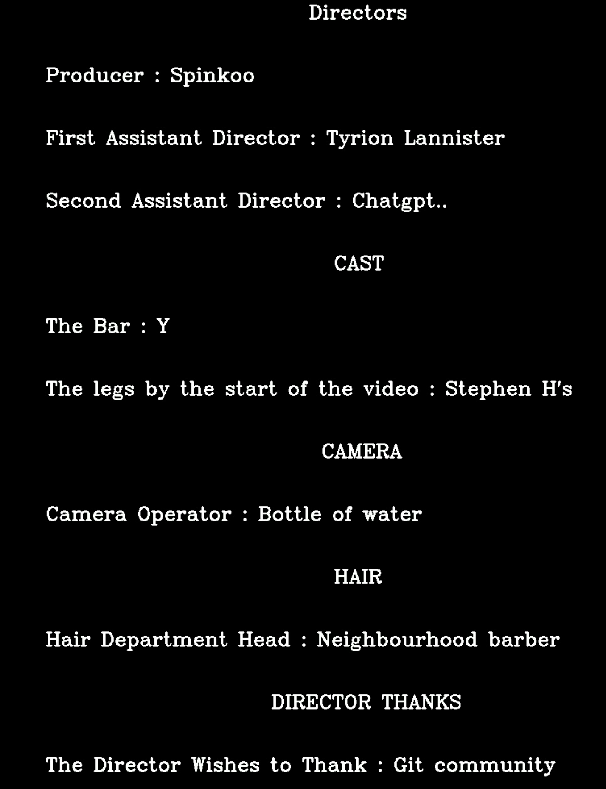

# pymoviecredits
Generate movie-credits style videos in python
For those like me tired of movie-credits-video-generators with watermarks, enjoy this.

a python script to generate homemade credits videos using OpenCV.


## Requirements

- Python
- OpenCV
- Pandas
- Numpy

## Usage

```
python credits.py
```
Main file is `credits.py` which generates a credits video from either:
- Static data in `data_reader.py` the dict returned by `read_credits_static()`
- Excel file in `credits.xlsx`
- CSV file in `credits.csv`

just change the `CREDIT_TYPE` variable in `credits.py` to the type of data you want to use.
Your options are:
- `CREDIT_TYPE = "static"` for static data
- `CREDIT_TYPE = "excel"` for excel file
- `CREDIT_TYPE = "csv"` for csv file

The dictionary consists of title, name pairs. For section titles, leave the second cell empty.
Example:

| Title | Name |
| ----- | ---- |
| Directors | |
| Producer | P |
| First Assistant Director | Tyrion Lannister |
| Cast | |

            Directors

    Prodcuer P

    First Assistant Director Tyrion Lannister

               Cast

